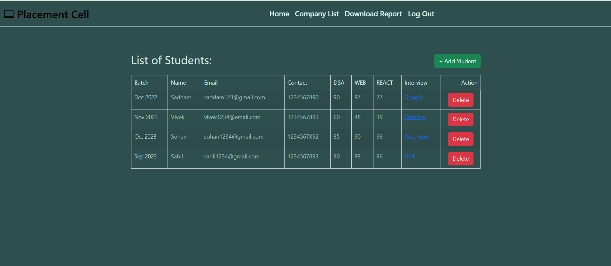
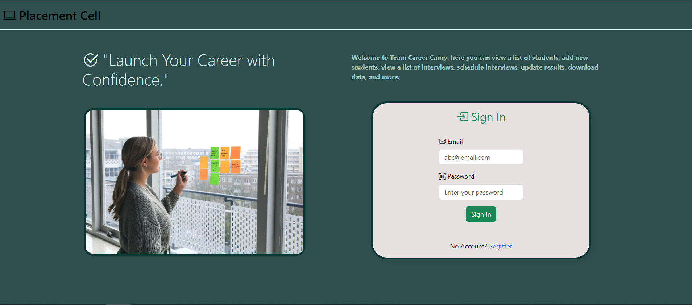
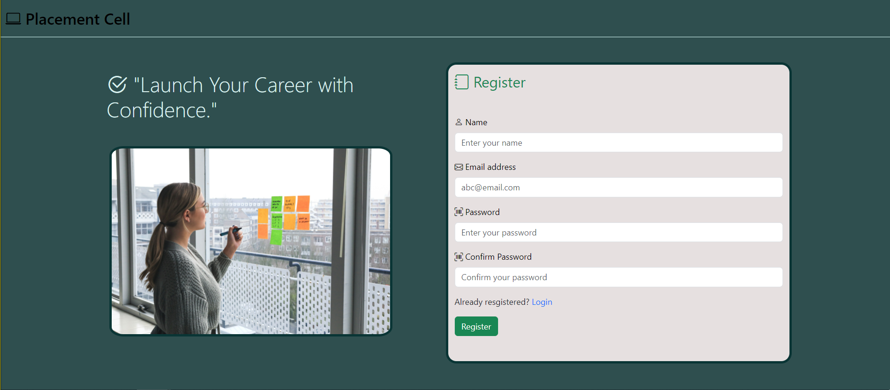
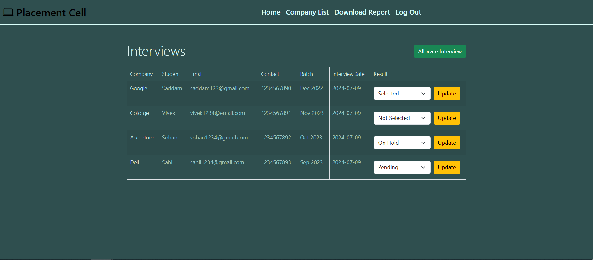

# Team Career Camp : Placement Cell Web Application

This web application is designed for Career Camp's placement cell to manage student interviews, scores, and results. Employees can add, view, and update data related to student details, course scores, interviews, and results.

## Features

- **Authentication:** Sign Up and Sign In functionality for employees.
- **Student Management:** CRUD operations for managing student details.
- **Interview Management:** CRUD operations for scheduling and managing interviews.
- **Result Management:** Allocate results (Selected, Not Selected, On Hold, Pending) to students based on interviews.

## Tech Stack

- **Frontend:** HTML, CSS, Bootstrap, JavaScript
- **Backend:** Node.js, Express.js
- **Database:** MongoDB via Mongoose
- **Other:** NPM for package management, Nodemon for auto-reloading server, VS Code for development

## Setup Instructions

- Fork the Project in your Repository.
- Clone the Forked Repository in your Local System.
- Install & Configure - NodeJS & MongoDB.
- Create '.env' file & Set the Environment Variables in it.
- Run 'npm install' in GitBash Terminal
- Run 'node index.js' in terminal to launch the project and get connect with the database.

Environment Variables:

- PORT = [Your Port]
- SECRET = [Your Secret]
- MONGODB_URI = [Your MongoDB URI]

The application will run on `http://localhost:8000`.

## How to Use

- **Sign Up and Sign In:** Employees can register and log into the application.
- **Manage Students:** Add, view, edit, and delete student records.
- **Manage Interviews:** Schedule new interviews, view interview details, and assign students to interviews.
- **Manage Results:** Mark interview results (Selected, Not Selected, On Hold, Pending) for each student.

## CSV Download

- **Download CSV:** Generate and download a CSV file containing student details, course scores, interview details, and results.

## Project Screenshot

1. **Homepage:**
   

2. **SignIn Page:**
   
   
3. **SignUp Page:**
   
   
4. **Company Details Page:**
   

- [Click here](https://placement-cell-application-djcl.onrender.com/) to access this deployed project

## Contributors

- [Ravikant Singh](https://github.com/ravikantsingh12)

## Follow me on

- [LinkedIn](https://www.linkedin.com/in/ravikant-singh-327a98241)

